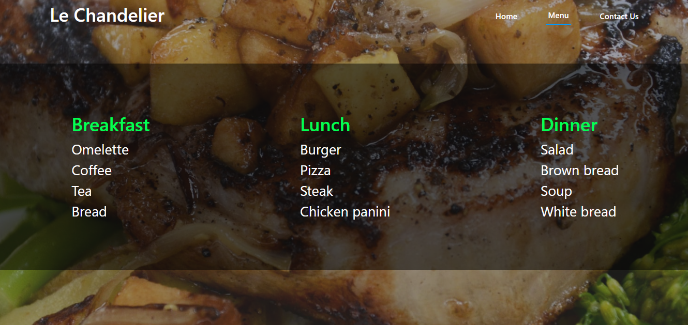

# Restaurant


## Description

> Restaurant is a single page app built with vanilla JS.

## Library Directory 📙

| Contents                    |
| --------------------------- |
| [Live Demo](#live-demo)     |
| [Screenshot](#screenshot)   |
| [Built With](#built-with-🛠) |
| [Authors](#authors)         |
| [License](#license)         |

## Live Demo

[Live demo](https://raw.githack.com/NtwaliHeritier/restaurant-js/feature/dist/index.html)

## Screenshot



## Built With 🛠

```
- Javascript
- HTML/CSS
- Boostrap
- VS Code
```

## Authors

### 👨‍💻 NTWALI Heritier

[](https://github.com/NtwaliHeritier) <br>
[](https://www.linkedin.com/in/ntwaliheritier/) <br>
[](mailto:ntwalihatsor78.nh@gmail.com) <br>
[](https://twitter.com/NtwaliHeritier)

### 🤝 Contributing

Contributions, issues and feature requests are welcome!

Feel free to check the [issues page](https://github.com/NtwaliHeritier/restaurant-js).

### Show your support

Give a ⭐️ if you like this project!

### License


